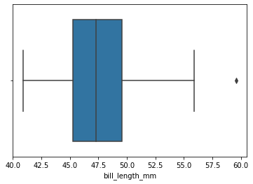

# Center and Variability

## Center
1. Define **mean**, **median**, and **mode**.

Mean is the average of all of the values, median is the midpoint value of the frequency distribution, and the mode is the value that shows up the most often.

2. When people talk about taking an average, which **measure of center** are they usually referring to?

- Mean

3. What is an **outlier**, and which measure of center does it affect the most?

An outlier is a value that is extremely dissimilar to most of the other values. It affects the meant he most. 

4. if the **median** is greater than the **mean**, what does that tell you about the _skew_ of the distribution?

It is skewed to the left.

5. Give an example of a situation where finding the **mode** of a dataset would be useful.

Finding the most common answer to a survey question.

6. Two datasets have the same **mean** of 1.15. Are these two datasets the same? Why or why not?

No, it simply means the average value is the same. The median, mode, and distribution could all be different.

## Variability
The **variability** of a dataset is also called its **spread**.

### Range
We will be examining the bill lengths of Gentoo penguins (again). Make sure you have Python code to read and analyze `penguins.csv`

1. What is the **range** of a dataset, and what is the **range** of Gentoo bill lengths?

27.5

A range is the difference between the maximum and minimum values of a dataset.

2. For this question, let's introduce a new datapoint: a bill length of `80.2`
   1. Does the range change, and if so, what is the new range?

- 48.1
- yes

   2. How will this affect the mean, median, and mode?

- It will increase the mean and median, but it won't affect the mode.

3. For this question, let's introduce 30 new observations, all with bill length `48.1`
   1. Does the range change, and if so, what is the new range?

   no 

   2. How will this affect the mean, median, and mode?

- It increased all of them

4. Based on your answers above, when do new data points affect the range?

   - when they are smaller or larger than every other value

5. What does the range tell us about a dataset, and what _doesn't_ it tell us?

- It tells us about the outliers, but nothing about the values in between

### Percentiles and Quartiles
1. What is a **percentile**, and is it a single point or an interval?

A percentile is an interval such that a dataset is divided into 100 percentiles.

2. What is a **quartile**?

- A quartile is the same as a percentile, but there are 4 quartiles of 25% each.

3. Why is the median sometimes called the **2nd quartile (Q2)**?

- Because 50% of the data lies below the median

4. Examine the following table. What can you tell about the _shape_ of this distribution?
    | Q0 | Q1 | Q2 | Q3 | Q4 |
    |:--:|:--:|:--:|:--:|:--:|
    |0|4|7|9|10|

   - It's skewed left

### IQR and Basic Visualizations
Shown below is a **box plot** of Gentoo bill lengths.

1. Where do the **whiskers** extend to?

- the min and max (excluding outliers)

2. What percentage of the dataset is represented by the **box**?

- 25%

3. What is an **interquartile range (IQR)**?

- the middle 50% of the dataset

4. Any observation that is `1.5*IQR` below Q1 or above Q3 is marked as a _potential_ outlier.
   1. How is this displayed in the box plot? Show the math necessary to determine that datapoint is an outlier.

- 

   2. The `1.5IQR` rule can give a false positive; that is, a datapoint that is marked as an outlier even when it isn't one. Describe an example where that happens.

Shown below is a **violin plot** for the same data.

1. How do the **box and whiskers** of a violin plot differ from those of a box plot

- 

2. What information does a violin plot provide that a box plot doesn't?
3. When would we want to use a violin plot over a box plot?

### Deviation
1. What is a datapoint's **deviation** in relation to the dataset mean?

- 

2. What is a dataset's **standard deviation**?
3. What is the standard deviation of Gentoo bill lengths?
4. What is an observation's **z-score**, and how is that related to a dataset's standard deviation?
5. Why might **z-score** be a better measure than deviation?